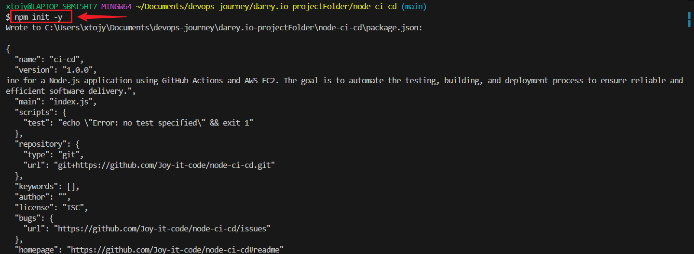
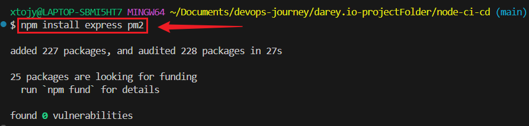
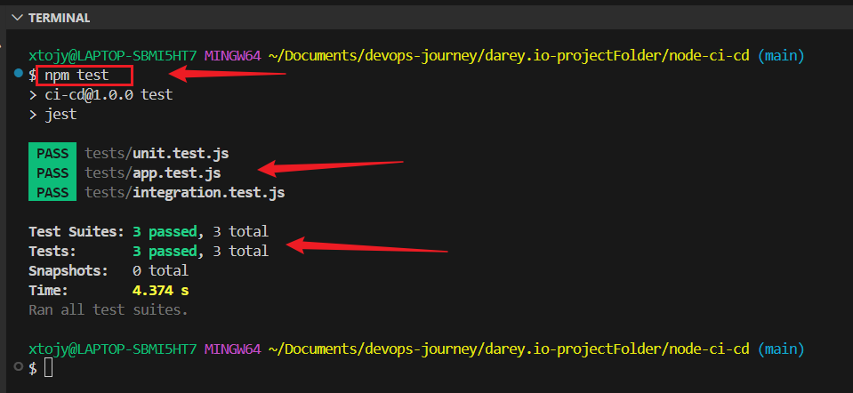

# Node.js CI/CD wi th GitHub Actions and AWS

## 🚀 Project Overview
This project demonstrates a Continuous Integration (CI) and Continuous Deployment (CD) pipeline for a Node.js application using GitHub Actions and AWS EC2. The goal is to automate the testing, building, and deployment process to ensure reliable and efficient software delivery.

## ✨ Key Features:
* CI with GitHub Actions: Automates testing and building on every commit and pull request.
* CD to AWS EC2: Deploys the Node.js application to an EC2 instance automatically.
* Version Control with GitHub: Ensures collaboration and code management.
* Process Management with PM2: Keeps the application running after deployment. 

## 🔧 Prerequisites

* 🖥️ Local Machine Requirements

* Node.js (version 20 recommended)

* Git

* VS Code

* A GitHub account

* ☁️ AWS Requirements

* An AWS account

* AWS EC2 instance (Ubuntu 22.04 LTS recommended)

* SSH key for secure deployment


## 📂 Project Setup

## 1️⃣ Setting Up the Repository

+ Create a new repository on GitHub and clone it:
```
git clone git clone https://github.com/Joy-it-code/node-ci-cd.git
cd node-ci-cd
```


+ Initialize a Node.js project:
```
npm init -y
```



## 2️⃣ Install Dependencies
```
npm install express pm2
```



+ **Create index.js**

Inside your project directory, create a file named index.js and add the following code:
```
nano index.js
```
```
const express = require('express');
const app = express();
const port = process.env.PORT || 3000;

app.get('/', (req, res) => {
    res.send("Hello World!");
});

app.listen(port, () => {
    console.log(`App listening at http://localhost:${port}`);
});
```

+ Test Locally:

Start your server by running:
```
node index.js
```
+ Navigate to http://localhost:3000 in your browser to ensure it says "Hello World!".


### Commit and Push:
Add your changes to Git and push them to the GitHub repository:
```
git add .
git commit -m "Initial commit"
git push origin main
```

## 3️⃣ ⚙️ Setting Up GitHub Actions

+ **Create GitHub Actions Workflow**
```
mkdir -p .github/workflows
nano .github/workflows/node-ci.yml
```

+ **Add CI Configuration:**
```
name: Node.js CI

on:
  push:
    branches: [ main ]
  pull_request:
    branches: [ main ]

jobs:
  build:
    runs-on: ubuntu-latest

    strategy:
      matrix:
        node-version: [20]

    steps:
      - name: Checkout repository
        uses: actions/checkout@v3

      - name: Set up Node.js ${{ matrix.node-version }}
        uses: actions/setup-node@v3
        with:
          node-version: ${{ matrix.node-version }}

      - name: Install dependencies
        run: npm ci

      - name: Run tests
        run: npm test
```

**Run Tests**
```
npm test
```
+ Commit and push the workflow
```
git add .github/workflows/node-ci.yml
git commit -m "Add GitHub Actions CI workflow"
git push origin main
```

+ Check the CI Status:
Go to the Actions tab in your GitHub repository to see if the workflow runs successfully.


## 4️⃣ Adding Testing and Deployment:

**🧪Add Testing**

Install Jest as a development dependency and verify:
```
npm install --save-dev supertest
npm install --save-dev jest
npx jest --version
```


+ **Update your package.json to use Jest for testing:**
```
"scripts": {
    "start": "node index.js",
    "test": "jest"
}
```

+ **Create a tests Directory and Add Test Cases**
Create a tests/app.test.js file and add a simple test:

```
mkdir tests
touch tests/app.test.js
```

**Add the following:**
```
const request = require("supertest");
const app = require("../index");  // Ensure your Express app is exported in index.js

describe("GET /", () => {
    it("should return 'Hello World!'", async () => {
        const res = await request(app).get("/");
        expect(res.statusCode).toBe(200);
        expect(res.text).toBe("Hello World!");
    });
});
```

+ **Modify index.js to Export the App**

I Updated index.js file to allow testing:

```
const express = require('express');
const app = express();
const port = process.env.PORT || 3000;

app.get('/', (req, res) => {
    res.send("Hello World!");
});

if (require.main === module) {
    app.listen(port, () => {
        console.log(`App listening at http://localhost:${port}`);
    });
}

module.exports = app; // Export app for testing
```

+ Run the Test:
```
npm test
```
+ Run the Application Locally and On Browser:
```
npm start
http://localhost:3000
```
+ Commit and Push
```
git add .github/workflows/node-ci.yml
git commit -m "Add GitHub Actions workflow"
git push origin main
```

**🌍 Deployment on AWS**

+ Set Up an EC2 Instance
+ Connect to the Instance 
+ Clone the Repository
```
ssh -i ci-cd-key.pem ubuntu@<your-ec2-public-ip>
git clone https://github.com/your-username/node-ci-cd.git
cd node-ci-cd

```

+ **Update and Install Required Software On EC2:**
```
sudo apt update
sudo apt install -y nodejs npm
sudo npm install -g pm2
sudo apt install -y git
npm install --save-dev jest
```

+ **Clone Your Repository**
```
git clone https://github.com/Joy-it-code/node-ci-cd.git
cd node-ci-cd
```

+ Start the App with PM2  

Run the following command inside ~/node-ci-cd:
```
pm2 start index.js --name "node-app"
pm2 save
pm2 startup
sudo env PATH=$PATH:/usr/bin /usr/local/lib/node_modules/pm2/bin/pm2 startup systemd -u ubuntu --hp /home/ubuntu
pm2 save
sudo reboot
```

**Check Running Processes**
```
pm2 list
```

**Run the Application Locally**
```
node index.js
```

+ Reconnect to the instance after the reboot using SSH:
```
ssh -i "ci-cd-key.pem" ubuntu@<your-ec2-public-ip>
pm2 list
curl ifconfig.me (to find EC2 pubic ip)
http://<your-ec2-public-ip>:3000/
```


+ Configure GitHub Actions for Deployment (Add new repository secrets).

+ **Update GitHub Actions for Deployment**

Inside your project, create a .github/workflows/deploy.yml file:
```
name: Deploy to AWS EC2

on:
  push:
    branches:
      - main

jobs:
  build-and-deploy:
    runs-on: ubuntu-latest

    steps:
    - name: Checkout Repository
      uses: actions/checkout@v2

    - name: Set up Node.js
      uses: actions/setup-node@v4
      with:
        node-version: 20

    - name: Install Dependencies
      run: npm ci

    - name: Run Tests
      run: npm test

    - name: Set up SSH Key
      run: |
        mkdir -p ~/.ssh
        echo "${{ secrets.EC2_SSH_KEY }}" > ~/.ssh/ci-cd-key
        chmod 600 ~/.ssh/ci-cd-key
        ssh-keyscan <your-ec2-public-ip> >> ~/.ssh/known_hosts

    - name: Deploy to AWS EC2
      uses: appleboy/ssh-action@master
      with:
        host: ${{ secrets.EC2_HOST }}
        username: ubuntu
        key: ${{ secrets.EC2_SSH_KEY }}
        script: |
          cd ~/node-ci-cd || git clone https://github.com/Joy-it-code/node-ci-cd.git ~/node-ci-cd
          cd ~/node-ci-cd
          git pull origin main
          npm install
          pm2 restart index.js || pm2 start index.js --name "node-app"
```

**🛠 Testing the Application**

* Steps to Set Up the Key

```
find ~/ -name "ci-cd-key.pem"
mv ~/Downloads/ci-cd-key.pem ~/.ssh/ci-cd-key.pem
ls ~/.ssh/
chmod 600 ~/.ssh/ci-cd-key.pem
ssh -o StrictHostKeyChecking=no -i ~/.ssh/ci-cd-key.pem ubuntu@<IP_ADDRESS> "echo Connected!"
```

+ Verify Your Application is Running on EC2
```
ssh -i ~/.ssh/ci-cd-key.pem ubuntu@<your-ec2-public-ip> "pm2 list"
```
+ Restart Application if not Running:
```
ssh -i ~/.ssh/ci-cd-key.pem ubuntu@<your-ec2-public-ip> 
cd ~/node-ci-cd && pm2 start index.js --name 'node-app'
```

**🔍 Testing API Endpoint**
📌 Check in Terminal:
```
curl http://<your-ec2-public-ip>:3000/
```
If it returns "Hello World!", the deployment was successful. 🎉

+ Check if the App is Accessible via the Browser:
```
http://<your-ec2-public-ip>:3000
```

ssh -i "~/.ssh/ci-cd-key.pem" ubuntu@<your-ec2-public-ip>
chmod 600 ~/.ssh/ci-cd-key.pem
ls ~/.ssh/
cat ~/.ssh/authorized_keys
ssh -i ~/.ssh/ci-cd-key.pem ubuntu@<your-ec2-public-ip>

+ Check for permission on local machine
```
chmod 600 ~/.ssh/ci-cd-key.pem
```
Server-Side Permissions and Verification on Local Machine:
```
chmod 600 ~/.ssh/authorized_keys
ssh -i ~/.ssh/ci-cd-key.pem
ubuntu@<your-ec2-public-ip>
```

**Test the workflow**
Push changes to the main branch and check the Actions tab in GitHub to monitor the deployment process. 


## 5️⃣ Experiment and Learn:

**🔹Modify Workflows to See How Changes Affect the CI/CD Process**
+ Experiment: Introduce an Intentional Failure

+ Modify index.test.js:
```
test("Deliberate Failure", () => {
  expect(1 + 1).toBe(3); // Incorrect assertion
});
```

**Test the change:**
+ Push this update to GitHub
+ Check if GitHub Actions marks the job as failed
+ Revert the change and push again to verify it passes

**🧪Add Unit Tests (For Individual Functions)**

Unit tests check small parts of your code independently.

+ Create tests/unit.test.js

Install Jest (Test Framework)
```
npm install --save-dev jest
```

+ Update package.json (Add Test Script)
Open your package.json and add this under "scripts":

```
"scripts": {
  "start": "node index.js",
  "test": "jest"
}
```
+ Run Test
```
npm test
```
 + Create a tests/unit.test.js File
```
mkdir -p tests
touch tests/unit.test.js
```

+ Then, open tests/unit.test.js and add:
```
// Import the function you want to test
const sum = (a, b) => a + b; // Example function

test('adds 2 + 3 to equal 5', () => {
  expect(sum(2, 3)).toBe(5);
});
```
Run the Test
```
npm test
```

**Add 🔄Integration Tests (For Multiple Modules)**

+ Integration tests check how different parts of your application work together.

+ Modify tests/integration.test.js:
```
const request = require("supertest");
const app = require("../index");

test("GET / should return Hello World!", async () => {
  const response = await request(app).get("/");
  expect(response.status).toBe(200);
  expect(response.text).toBe("Hello World!");
});
```

Run Test and Push to GitHub:
```
npm test
```



## ❗ Troubleshooting

If SSH fails, verify the key permissions:
```
chmod 400 aws-key.pem
```

If deployment fails, check logs in EC2:
```
pm2 logs
```

**Test the workflow**
Push changes to the main branch and check the Actions tab in GitHub to monitor the deployment process. 

## Conclusion

This project showcases a streamlined CI/CD process for Node.js applications, integrating automated testing, deployment, and process management. By leveraging GitHub Actions and PM2, the pipeline ensures reliable and scalable deployments with minimal manual intervention.


**📌 Author: Joy**

**🎉 Happy Coding! 🚀**