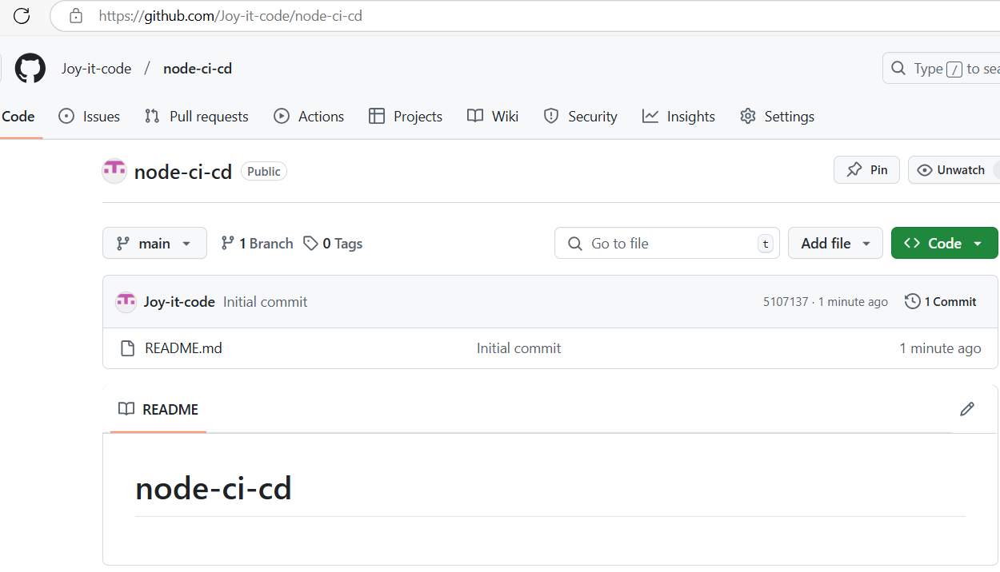
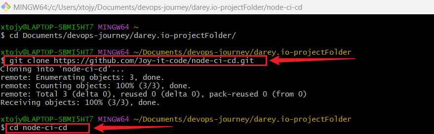
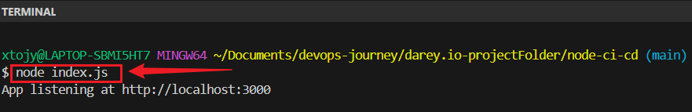
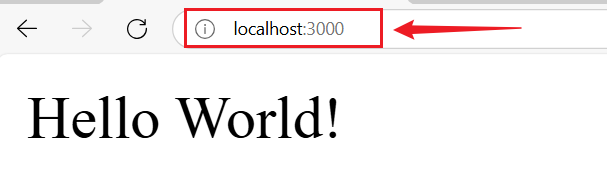

# Node.js CI/CD with GitHub Actions and AWS

## 🚀 Project Overview
This project demonstrates a Continuous Integration (CI) and Continuous Deployment (CD) pipeline for a Node.js application using GitHub Actions and AWS EC2. The goal is to automate the testing, building, and deployment process to ensure reliable and efficient software delivery.

## ✨ Key Features:
* CI with GitHub Actions: Automates testing and building on every commit and pull request.
* CD to AWS EC2: Deploys the Node.js application to an EC2 instance automatically.
* Version Control with GitHub: Ensures collaboration and code management.
* Process Management with PM2: Keeps the application running after deployment.

## 📂 Project Setup

## 1️⃣ Setting Up the Repository

+ Create a new repository on GitHub and clone it:
```
git clone git clone https://github.com/Joy-it-code/node-ci-cd.git
cd node-ci-cd
```




+ Initialize a Node.js project:
```
npm init -y
```

## 2️⃣ Install Dependencies
```
npm install express pm2
```

3️⃣ Create index.js

Inside your project directory, create a file named index.js and add the following code:
```
nano index.js
```
```
const express = require('express');
const app = express();
const port = process.env.PORT || 3000;

app.get('/', (req, res) => {
    res.send("Hello World!");
});

app.listen(port, () => {
    console.log(`App listening at http://localhost:${port}`);
});
```

+ Test Locally:

Start your server by running:
```
node index.js
```
+ Navigate to http://localhost:3000 in your browser to ensure it says "Hello World!".



### Commit and Push:
Add your changes to Git and push them to the GitHub repository:
```
git add .
git commit -m "Initial commit"
git push origin main
```

## 3️⃣ ⚙️ Setting Up GitHub Actions

+ **Create GitHub Actions Workflow**
```
mkdir -p .github/workflows
nano .github/workflows/node-ci.yml
```

+ Add CI Configuration:
```
name: Node.js CI

on:
  push:
    branches: [ main ]
  pull_request:
    branches: [ main ]

jobs:
  build:
    runs-on: ubuntu-latest

    strategy:
      matrix:
        node-version: [20]

    steps:
      - name: Checkout repository
        uses: actions/checkout@v3

      - name: Set up Node.js ${{ matrix.node-version }}
        uses: actions/setup-node@v3
        with:
          node-version: ${{ matrix.node-version }}

      - name: Install dependencies
        run: npm ci

      - name: Run tests
        run: npm test
```

+ Commit and push the workflow
```
git add .github/workflows/node-ci.yml
git commit -m "Add GitHub Actions CI workflow"
git push origin main
```

+ Check the CI Status:

Go to the Actions tab in your GitHub repository to see if the workflow runs successfully.

Yesterday
introduction to continuous integration and continuous deployment Practical Implementation Setting Up the Project: 1. Initialize a GitHub Repository: . Create a new repository on GitHub. . Clone it to your local machine. 2. Create a Simple Node.js Application: . Initialize a Node.js project ("npm init"). . Create a simple server using Express.js to serve a static web page. . Add your code to the repository and push it to GitHub. // Example: index.js const express = require('express'); const app = express(); const port = process.env.PORT || 3000; app.get('/', (req, res) => {"\n res.send("Hello World!');\n "}); app.listen(port, () => { console.log('App listening at http://localhost:${port}'); }); 3. Writing Your First GitHub Action Workflow: . Create a ".github/workflows" directory in your repository. . Add a workflow file (e.g., "node. js.ym1"). # Example: .github/workflows/node.js.yml # Name of the workflow name: Node.js CI # Specifies when the workflow should be triggered # Triggers the workflow on 'push' events to the 'main' branch push: branches: [ main ] # Also triggers the workflow on 'pull_request' events targeting the 'main' branch pull_request: branches: [ main ] # Defines the jobs that the workflow will execute jobs: # Job identifier, can be any name (here it's 'build") build: # Specifies the type of virtual host environment (runner) to use runs-on: ubuntu-latest # Strategy for running the jobs - this section is useful for testing across multiple environments strategy: # A matrix build strategy to test against multiple versions of Node.js matrix: node-version: [20] # Steps represent a sequence of tasks that will be executed as part of the job steps: # Checks-out your repository under $GITHUB_WORKSPACE, so the job can access it uses: actions/checkout@v2 - # Sets up the specified version of Node.js name: Use Node.js ${{" matrix.node-version "}} uses: actions/setup-node@v1 with: node-version: ${{" matrix.node-version "}} - # Installs node modules as specified in the project's package-lock.json run: npm ci - # This command will only run if a build script is defined in the package. json run: npm run build -- if-present - # Runs tests as defined in the project's package.json run: npm test Explanation: This workflow is a basic example for a Node.js project, demonstrating how to automate testing across different Node.js versions and ensuring that your code integrates and works as expected in a clean environment. 4. Testing and Deployment: . Add automated tests for your application. . Create a workflow for deployment (AWS) 5. Experiment and Learn: . Modify workflows to see how changes affect the CI/CD process. . Try adding different types of tests (unit tests, integration tests). i want to do this mini project i need a detailed step by step method to carry out this project. note ensure all the script/workflow is correct. thanks
Got it! Here’s a detailed, step-by-step guide to help you complete this mini project successfully:

Step 1: Initialize a GitHub Repository
Create the Repository:

Go to GitHub and create a new repository.

Name the repository (e.g., ci-cd-nodejs) and make it public or private as needed.

Clone the Repository:

Open your terminal and run:

bash
git clone <repository-url>
cd ci-cd-nodejs
Step 2: Create a Simple Node.js Application
Initialize the Node.js Project:

Run the following commands:

bash
npm init -y
npm install express
This sets up a basic Node.js project with Express.js as a dependency.

Write the Application Code:

Create a file named index.js in the root directory and add the following code:

javascript
const express = require('express');
const app = express();
const port = process.env.PORT || 3000;

app.get('/', (req, res) => {
    res.send('Hello World!');
});

app.listen(port, () => {
    console.log(`App listening at http://localhost:${port}`);
});
Test Locally:

Start your server by running:

bash
node index.js
Navigate to http://localhost:3000 in your browser to ensure it says "Hello World!".

Commit and Push:

Add your changes to Git and push them to the GitHub repository:

bash
git add .
git commit -m "Initial commit with Node.js app"
git push origin main
Step 3: Set Up a GitHub Action for Continuous Integration
Create a Workflow Directory:

Inside your repository, create a .github/workflows directory:

bash
mkdir -p .github/workflows
Add the Workflow File:

Create a file named node.js.yml in the .github/workflows directory with the following content:

yaml
name: Node.js CI

on:
  push:
    branches: [ main ]
  pull_request:
    branches: [ main ]

jobs:
  build:
    runs-on: ubuntu-latest

    strategy:
      matrix:
        node-version: [20]

    steps:
    - name: Check out code
      uses: actions/checkout@v2

    - name: Set up Node.js ${{ matrix.node-version }}
      uses: actions/setup-node@v1
      with:
        node-version: ${{ matrix.node-version }}

    - name: Install dependencies
      run: npm ci

    - name: Build project
      run: npm run build --if-present

    - name: Run tests
      run: npm test
Commit the Workflow:

Push the new workflow to GitHub:

bash
git add .github/workflows/node.js.yml
git commit -m "Added CI workflow"
git push origin main
Check the CI Status:

Go to the Actions tab in your GitHub repository to see if the workflow runs successfully.

Step 4: Testing and Deployment
Write Automated Tests:

Install a testing framework like Jest:

bash
npm install --save-dev jest
Add a simple test file test/index.test.js:

javascript
test('Sample test', () => {
    expect(2 + 2).toBe(4);
});
Update the package.json to include a test script:

json
"scripts": {
    "test": "jest"
}
Run the Tests Locally:

Verify the tests:

bash
npm test
Create a Deployment Workflow:

Set up a deployment workflow to AWS, Heroku, or any other service:

For AWS, use aws-actions/configure-aws-credentials GitHub Action to configure AWS CLI.

Example workflow snippet:

yaml
- name: Deploy to AWS S3
  run: aws s3 sync ./build s3://your-bucket-name --delete
Commit and Test Deployment Workflow:

Push the deployment workflow file and validate its execution in GitHub Actions.

Step 5: Experiment and Extend
Enhance Workflows:

Add caching to optimize CI/CD pipelines:

yaml
- name: Cache dependencies
  uses: actions/cache@v2
  with:
    path: ~/.npm
    key: ${{ runner.os }}-node-${{ hashFiles('**/package-lock.json') }}
    restore-keys: |
      ${{ runner.os }}-node-
Add Advanced Tests:

Implement unit, integration, and end-to-end tests.

Explore CD Tools:

Experiment with CD solutions like GitHub Pages, Netlify, or Docker.

Let me know if you'd like me to elaborate on any of these steps or troubleshoot specific parts as you implement your project!

please give me a perfect readme.md that include all necessary steps and put a detailed markdowns for my documentation on vscode. thanks
Here’s a detailed README.md file tailored to your CI/CD Node.js mini project. This document is styled to be clear and professional, perfect for showcasing your project and guiding others.

CI/CD Node.js Mini Project
This project demonstrates setting up a Continuous Integration (CI) and Continuous Deployment (CD) pipeline for a simple Node.js application. The workflow is configured using GitHub Actions to automate testing and deployment processes.

Project Overview
This project focuses on:

Creating a basic Node.js application with Express.js..

Implementing automated testing and building pipelines.

Leveraging GitHub Actions to achieve CI/CD.

Deploying the application to the hosting service of your choice.

Prerequisites
Before you begin, ensure you have the following installed on your system:

Node.js (v20 or higher)

npm (bundled with Node.js)

Git for version control

A GitHub Account to host your repository

Getting Started
Step 1: Setting Up the Repository
Create a new repository on GitHub and clone it:

bash
git clone <repository-url>
cd <repository-name>
Initialize a Node.js project:

bash
npm init -y
Install the required dependencies:

bash
npm install express
Step 2: Building the Application
Create an index.js file and add the following code:

javascript
const express = require('express');
const app = express();
const port = process.env.PORT || 3000;

app.get('/', (req, res) => {
    res.send('Hello World!');
});

app.listen(port, () => {
    console.log(`App listening at http://localhost:${port}`);
});
Test the application locally:

bash
node index.js
Open your browser at http://localhost:3000 to verify it works.

Step 3: Version Control
Add the project files to Git:

bash
git add .
git commit -m "Initial Node.js app"
git push origin main
Step 4: Implementing CI with GitHub Actions
Create the directory for workflows:

bash
mkdir -p .github/workflows
Add the workflow file .github/workflows/node.js.yml:

yaml
name: Node.js CI

on:
  push:
    branches: [ main ]
  pull_request:
    branches: [ main ]

jobs:
  build:
    runs-on: ubuntu-latest

    strategy:
      matrix:
        node-version: [20]

    steps:
    - name: Checkout repository
      uses: actions/checkout@v2

    - name: Setup Node.js ${{ matrix.node-version }}
      uses: actions/setup-node@v1
      with:
        node-version: ${{ matrix.node-version }}

    - name: Install dependencies
      run: npm ci

    - name: Run tests
      run: npm test
Push the workflow:

bash
git add .github/workflows/node.js.yml
git commit -m "Added CI workflow"
git push origin main
Verify the CI pipeline by checking the Actions tab in your GitHub repository.

## 4️⃣ Adding Testing and Deployment:

**🔹Add Testing**

Install Jest as a development dependency and verify:
```
npm install --save-dev supertest
npm install --save-dev jest
npx jest --version
```


+ **Update your package.json to use Jest for testing:**
```
"scripts": {
    "start": "node index.js",
    "test": "jest"
}
```
+ **Create a tests Directory and Add Test Cases**
Create a tests/app.test.js file and add a simple test:

```
mkdir tests
touch tests/app.test.js
```

**Add the following:**
```
const request = require("supertest");
const app = require("../index");  // Ensure your Express app is exported in index.js

describe("GET /", () => {
    it("should return 'Hello World!'", async () => {
        const res = await request(app).get("/");
        expect(res.statusCode).toBe(200);
        expect(res.text).toBe("Hello World!");
    });
});
```

+ **Modify index.js to Export the App**

I Updated index.js file to allow testing:

```
const express = require('express');
const app = express();
const port = process.env.PORT || 3000;

app.get('/', (req, res) => {
    res.send("Hello World!");
});

if (require.main === module) {
    app.listen(port, () => {
        console.log(`App listening at http://localhost:${port}`);
    });
}

module.exports = app; // Export app for testing
```

+ Run the Test:
```
npm test
```
+ Run the Application Locally and On Browser:
```
npm start
http://localhost:3000
```
+ Commit and Push
```
git add .github/workflows/node-ci.yml
git commit -m "Add GitHub Actions workflow"
git push origin main
```

**🌍 Deployment on AWS**

+ Set Up an EC2 Instance
+ Connect to the Instance
```
ssh -i ci-cd-key.pem ubuntu@<your-ec2-public-ip>
```

+ **Update and Install Required Software On EC2:**
```
sudo apt update
sudo apt install -y nodejs npm
sudo npm install -g pm2
sudo apt install -y git
npm install --save-dev jest
```

+ **Clone Your Repository**
```
git clone https://github.com/Joy-it-code/node-ci-cd.git
cd node-ci-cd
```

+ Start the App with PM2  

Run the following command inside ~/node-ci-cd:
```
pm2 start index.js --name "node-app"
pm2 save
pm2 startup
sudo env PATH=$PATH:/usr/bin /usr/local/lib/node_modules/pm2/bin/pm2 startup systemd -u ubuntu --hp /home/ubuntu
pm2 save
sudo reboot
```

+ Reconnect to the instance after the reboot using SSH:
```
ssh -i "ci-cd-key.pem" ubuntu@98.81.255.24
pm2 list
curl ifconfig.me (to find EC2 pubic ip)
http://98.81.255.24:3000/
```


+ Configure GitHub Actions for Deployment (Add new repository secrets).

+ **Update GitHub Actions for Deployment**

Inside your project, create a .github/workflows/deploy.yml file:
```
name: Deploy to AWS EC2

on:
  push:
    branches:
      - main

jobs:
  build-and-deploy:
    runs-on: ubuntu-latest

    steps:
    - name: Checkout Repository
      uses: actions/checkout@v2

    - name: Set up Node.js
      uses: actions/setup-node@v4
      with:
        node-version: 20

    - name: Install Dependencies
      run: npm ci

    - name: Run Tests
      run: npm test

    - name: Debug SSH Connection
      run: ssh -o StrictHostKeyChecking=no -i ~/.ssh/id_rsa ubuntu@${{ secrets.EC2_HOST }} "echo Connected!"

    - name: Deploy to AWS EC2
      uses: appleboy/ssh-action@master
      with:
        host: ${{ secrets.EC2_HOST }}
        username: ubuntu  # Change if necessary
        key: ${{ secrets.EC2_SSH_KEY }}
        script: |
          cd ~/node-ci-cd || git clone https://github.com/Joy-it-code/node-ci-cd.git ~/node-ci-cd
          cd ~/node-ci-cd
          git pull origin main
          npm install
          pm2 restart node-app || pm2 start index.js --name "node-app"
```


**🛠 Testing the Application**

Verify Deployment on local Terminal:
```
curl http://98.81.255.24:3000/
```
If it returns "Hello World!", the deployment was successful. 🎉

## 5️⃣ Experiment and Learn:
+ Test the Workflow:

Push your changes to the main branch and check the Actions tab in GitHub to monitor the deployment process.